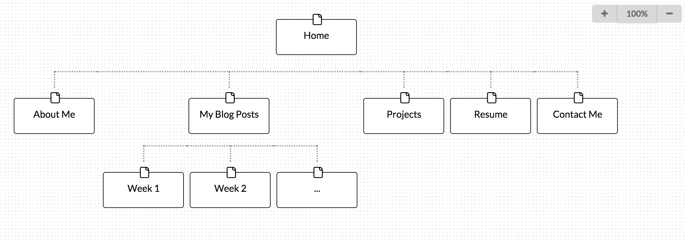

1. What are the 6 Phases of Web Design?

They are: Information Gathering, Planning, Design, Development, Testing and Delivery, and finally Maintenance.

2. What is your site's primary goal or purpose? What kind of content will your site feature?

My site's primary goal is to let others know more about myself and help myself stand out from others in the eyes of potential employers. I would like my site to feature my background, my resume and the projects that I have worked on.

3. What is your target audience's interests and how do you see your site addressing them?

My target audience would be potential employers. They might be interested in knowing my academic background and my working experience. Hence, I will put my resume, my background and my projects on my website.

4. What is the primary "action" the user should take when coming to your site? Do you want them to search for information, contact you, or see your portfolio? It's ok to have several actions at once, or different actions for different kinds of visitors.

For potential employers I would like them to look for my resume and my portfolio. For my friends or people who just come to by website by chance, I would like them to look for my recent updates and know more about my background.

5. What are the main things someone should know about design and user experience?

Design and user experience has no traditional clear metrics to measure. In different situations, different design may appeal to different types of users. Hence, it is not a one size fits all concept.

6. What is user experience design and why is it valuable?

User experience design addresses how a user feels when using a system or browsing a website. It is valuable because without an appealing and comfortable outlook and framework, users may feel reluctant to browse your site even if it contains some really awesome information.

7. Which parts of the challenge did you find tedious?

The part which I have read through the readings on what is UX design.