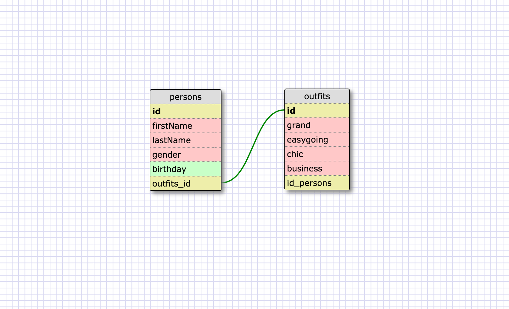

1 - Select all data for all states

`select * from states;`

2 - Select all data for all regions

`select * from regions;`

3 - Select the state_name and population for all states

`select state_name, population from states;`

4 - Select the state_name and population for all states ordered by population. The state with the highest population should be at the top

`select state_name, population from states order by population desc;`

5 - Select the state_name for the states in region 7

`select state_name from states where region_id = 7;`

6 - Select the state_name and population_density for states with a population density over 50 ordered from least to most dense

`select state_name, population_density from states where population_density > 50 order by poppulation_density asc;`

7 - Select the state_name for states with a population between 1 million and 1.5 million people.

`select state_name from states where population between 1000000 and 1500000;`

8 - Select the state_name and region_id for states ordered by region in ascending order.

`select state_name, region_id from states order by region_id;`

9 - Select the region_name for the regions with "Central" in the name

`select region_name from regions where region_name like '%Central%';`

10 - Select the region_name and the state_name for all states and regions in ascending order by region_id. Refer to the region by name. (This will involve joining the tables).

`select regions.region_name, states.state_name from regions inner join states on regions.id = states.region_id;`

