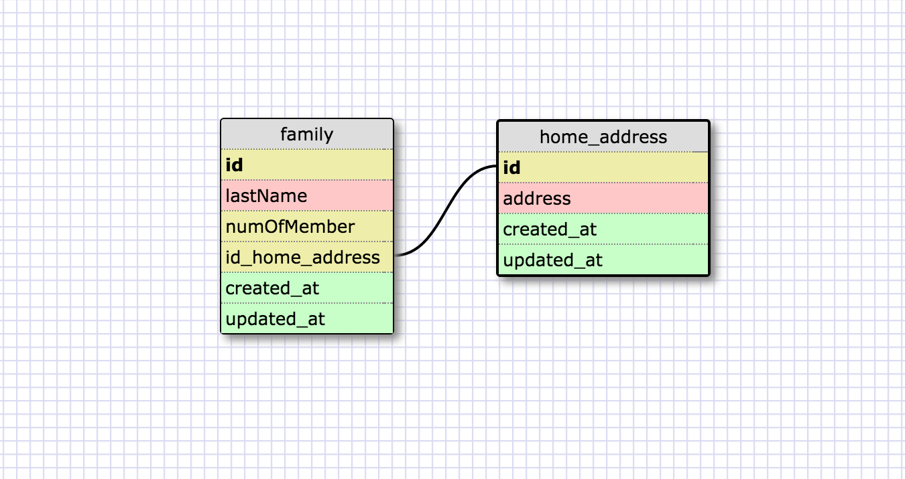
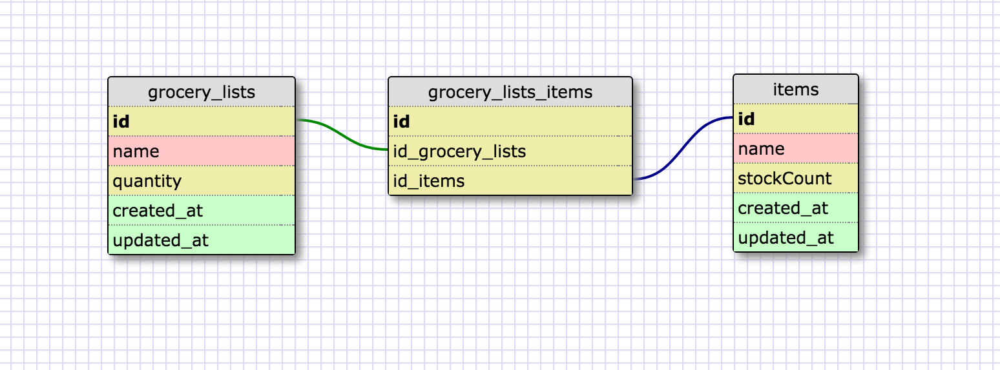

* What is a one-to-one database?

A one-to-one database is used when two things have a single relationship to one another, like a pair. They are unique to each other. One example is a country and its capital. A country has a capital city, and the capital city is only in one country.

* When would you use a one-to-one database? (Think generally, not in terms of the example you created).

I will use a one-to-one database when a group of fields can all be optionally empty.

* What is a many-to-many database?

A many-to-many database is used A can be related to many B while B can also be related to many A.

* When would you use a many-to-many database? (Think generally, not in terms of the example you created).

I will use it when there is field A in table 1 that can be related to many values of field B in table 2, while field B in table 2 can also be related to many values of field A in table 1.

* What is confusing about database schemas? What makes sense?

Everything makes sense for now, just that I have to practice more with the one-to-one, one-to-many and many-to-many relationships in order to be more familiar and know when to use which.

